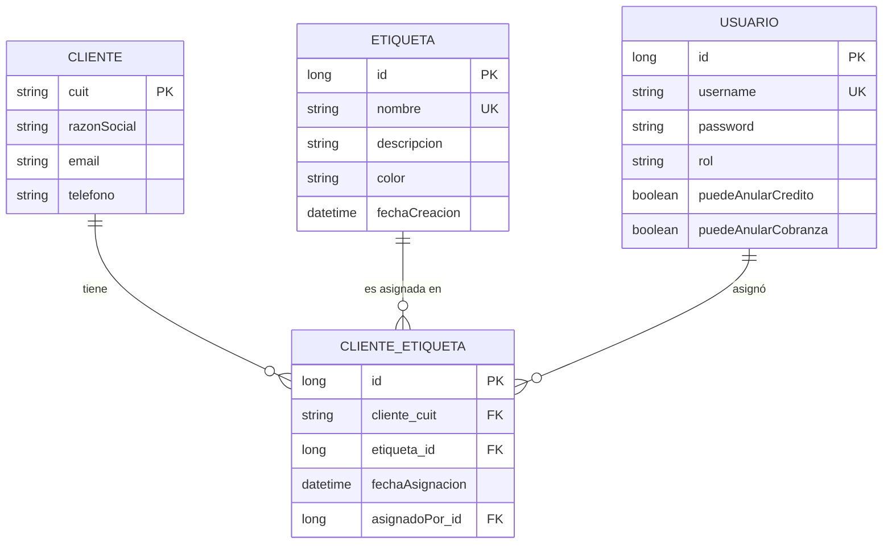

# Sistema de Etiquetas para Clientes — TPO Aplicaciones Interactivas 2026

**Materia:** Aplicaciones Interactivas (3.4.082) — UADE  
**Cuatrimestre:** 2026 — Primer cuatrimestre  

Este proyecto es la implementación del módulo **"Sistema de Etiquetas para Clientes"** sobre el proyecto base provisto por la cátedra. A continuación se encuentra la documentación completa solicitada, incluyendo el manual de usuario, la documentación técnica y el modelado de datos.

---

## 1. Descripción del Módulo

El módulo de "Sistema de Etiquetas" introduce la capacidad de categorizar y segmentar a los clientes del sistema de Créditos y Cobranzas de forma dinámica. A través de este módulo, los usuarios pueden crear etiquetas personalizadas (como "VIP", "Moroso", "Mayorista", con sus respectivos colores y descripciones) y asignarlas a los clientes existentes.

El sistema mantiene un registro histórico auditado de las asignaciones, guardando no solo qué etiqueta tiene cada cliente, sino también la fecha exacta en la que se aplicó y qué usuario del sistema realizó dicha asignación.


---

## 📚 Índice

1. [Descripción del Módulo](#-descripción-del-módulo)
2. [Manual de Usuario](#-manual-de-usuario)
3. [Documentación Técnica](#-documentación-técnica)
4. [Modelado de Datos](#-modelado-de-datos)

---

## 📘 Manual de Usuario

**Materia:** Aplicaciones Interactivas (3.4.082) — UADE  
**Entrega:** 1  
**Sistema Operativo:** Windows 10 / 11  

---

### Índice

1. [Requisitos previos](#1-requisitos-previos)
2. [Cómo levantar el Backend](#2-cómo-levantar-el-backend)
3. [Cómo levantar el Frontend](#3-cómo-levantar-el-frontend)
4. [Cómo usar la aplicación](#4-cómo-usar-la-aplicación)
5. [Verificación técnica con la API (Postman)](#5-verificación-técnica-con-la-api-postman)
6. [Consultar la base de datos H2](#6-consultar-la-base-de-datos-h2)
7. [Errores frecuentes](#7-errores-frecuentes)

---

### 1. Requisitos previos

Antes de comenzar, instalar las siguientes herramientas. Para verificar si ya están instaladas, abrir **cmd** o **PowerShell** y ejecutar los comandos indicados.

| Herramienta | Versión mínima | Cómo verificar en cmd |
|---|---|---|
| **Maven** | 3.9+ | `mvn -version` |
| **Node.js** | 18 | `node -v` |
| **npm** | 9 | `npm -v` |

#### ¿Cómo saber si Maven está instalado?

Abrir **cmd** y ejecutar:
```cmd
mvn -version
```
Debe mostrar información sobre la versión de Apache Maven (ej: `Apache Maven 3.9.x`).
Si dice `'mvn' no se reconoce como un comando`, hay que instalarlo siguiendo estos pasos:

1. Entrar a 👉 [https://maven.apache.org/download.cgi](https://maven.apache.org/download.cgi) y descargar el archivo terminando en **`-bin.zip`** (ej: `apache-maven-3.9.9-bin.zip`).
2. Descomprimir la carpeta descargada en la unidad `C:\` (por ejemplo, que quede en `C:\apache-maven-3.9.9`).
3. Apretar la tecla Windows, escribir **"Variables de entorno"** y abrir "Editar las variables de entorno del sistema".
4. Hacer clic en **"Variables de entorno..."** (abajo de todo).
5. En la sección "Variables del sistema" (la lista de abajo), buscar la variable **"Path"**, seleccionarla y hacer clic en **"Editar..."**.
6. Hacer clic en **"Nuevo"** y escribir la ruta hacia la carpeta `bin` de Maven. Debe ser algo como: `C:\apache-maven-3.9.9\bin`
7. Aceptar en todas las ventanas. **Importante:** Hay que cerrar cualquier ventana de `cmd` que esté abierta y abrir una nueva para que reconozca a Maven.

#### ¿Cómo saber si Java está bien instalado?

Abrir **cmd** (Win + R → escribir `cmd` → Enter) y ejecutar:
```
java -version
```
Debe mostrar algo como:
```
openjdk version "21.0.10" 2024-01-16 LTS
```
Si dice `'java' no se reconoce como un comando`, hay que instalar el JDK 21 desde:  
👉 https://adoptium.net (descargar **Temurin 21 LTS**, installer para Windows x64)

#### ¿Cómo saber si Node.js está instalado?

```
node -v
```
Debe mostrar: `v18.x.x` o superior. Si no está instalado, descargarlo desde:  
👉 https://nodejs.org (descargar la versión **LTS**)

---

> **Nota sobre la base de datos:** El proyecto usa **H2**, una base de datos que corre en la memoria RAM junto al backend. **No hace falta instalar MySQL, PostgreSQL ni ningún otro motor.** Los datos se pierden al cerrar el backend, lo cual es normal.

---

### 2. Cómo levantar el Backend

#### Paso 1 — Abrir una ventana de cmd en la carpeta del backend

**Opción A (más fácil):**
1. Abrir el Explorador de Windows.
2. Navegar hasta la carpeta `codigo\backend`.
3. Hacer clic en la barra de direcciones → escribir `cmd` → presionar **Enter**.

**Opción B (desde cmd):**
```cmd
cd "C:\ruta\donde\clonaron\el\proyecto\codigo\backend"
```

#### Paso 2 — Ejecutar el backend

En la ventana de cmd que se abrió dentro de `codigo\backend`, escribir:

```cmd
mvn spring-boot:run
```

La primera vez que se ejecuta, Maven descargará las dependencias del proyecto (puede tardar varios minutos dependiendo de la conexión a internet). Las veces siguientes será casi instantáneo.

#### Paso 3 — Verificar que levantó correctamente

Cuando el backend está listo, la consola muestra algo similar a:

```
  .   ____          _            __ _ _
 /\\ / ___'_ __ _ _(_)_ __  __ _ \ \ \ \
...
Started TpEjemploApplication in 4.321 seconds (JVM running for 5.012)
```

✅ El backend está disponible en: **`http://localhost:8080`**

> **⚠️ Error de memoria (OOM):** Si la ventana se cierra sola con un error, seguir los pasos en la [sección de errores frecuentes](#7-errores-frecuentes).

> **⚠️ No cerrar esta ventana de cmd.** Si se cierra, el backend deja de funcionar.

---

### 3. Cómo levantar el Frontend

El frontend necesita que **el backend esté corriendo** (sección anterior). Abrir una **segunda ventana de cmd**.

#### Paso 1 — Abrir una nueva ventana de cmd en la carpeta del frontend

**Opción A (más fácil):**
1. En el Explorador de Windows, navegar hasta `codigo\frontend`.
2. Hacer clic en la barra de direcciones → escribir `cmd` → **Enter**.

**Opción B:**
```cmd
cd "C:\ruta\donde\clonaron\el\proyecto\codigo\frontend"
```

#### Paso 2 — Instalar las dependencias (solo la primera vez)

```cmd
npm install
```

Este comando descarga todas las librerías de React que necesita el proyecto. Puede tardar 1-2 minutos. Solo hay que hacerlo **una vez**.

#### Paso 3 — Iniciar el servidor de desarrollo

```cmd
npm run dev
```

La consola muestra algo como:

```
  VITE v6.x.x  ready in 350 ms

  ➜  Local:   http://localhost:5173/
```

✅ La aplicación está disponible en: **`http://localhost:5173`**

Abrir esa dirección en el navegador (Chrome, Edge, Firefox).

> **Nota:** El frontend redirige automáticamente todas las llamadas al backend. No hace falta configurar nada adicional.

> **⚠️ No cerrar esta segunda ventana de cmd** mientras se usa la aplicación.

---

### 4. Cómo usar la aplicación

Con ambas ventanas de cmd abiertas y corriendo, abrir **`http://localhost:5173`** en el navegador.

#### 4.1 Registrarse (primera vez)

1. En la pantalla inicial, hacer clic en **Registrarse** (o ir a `/register`).
2. Completar un nombre de usuario y contraseña.
3. Hacer clic en **Registrar**.
4. Si el registro fue exitoso, el sistema inicia sesión automáticamente y redirige al panel principal.

#### 4.2 Iniciar sesión

1. En la pantalla de **Login**, ingresar el usuario y contraseña registrados.
2. Hacer clic en **Iniciar sesión**.
3. El token de autenticación se guarda en el navegador automáticamente.

#### 4.3 Gestionar Clientes

Desde el menú **Clientes**:

| Acción | Descripción |
|---|---|
| **Crear cliente** | Ingresar CUIT (ej: `20-12345678-5`), nombre, razón social, email y teléfono |
| **Ver listado** | Lista todos los clientes cargados en el sistema |
| **Filtrar por etiqueta** | Usar el campo de búsqueda con el nombre de una etiqueta |
| **Editar** | Modificar los datos de un cliente existente |
| **Eliminar** | Eliminar un cliente *(solo si no tiene créditos ni etiquetas asignadas)* |

#### 4.4 Gestionar Etiquetas

Desde el menú **Etiquetas**:

| Acción | Descripción |
|---|---|
| **Crear etiqueta** | Nombre (ej: `VIP`), descripción opcional y color en formato hexadecimal (ej: `#E63946`) |
| **Ver listado** | Ver todas las etiquetas disponibles |
| **Editar** | Modificar nombre, descripción o color |
| **Eliminar** | Eliminar una etiqueta *(solo si ningún cliente la tiene asignada)* |

#### 4.5 Asignar etiquetas a clientes

Desde el detalle de un **Cliente**:
1. Hacer clic en "Asignar etiqueta".
2. Seleccionar la etiqueta deseada del listado.
3. El sistema registra automáticamente la fecha y el usuario que realizó la asignación.

Para quitar una etiqueta, hacer clic en el ícono de eliminar junto a la etiqueta asignada.

#### 4.6 Gestionar Créditos y Cobranzas

Desde el menú **Créditos**:
- Registrar un nuevo crédito para un cliente indicando: deuda original, fecha, importe de cuota y cantidad de cuotas.
- El sistema genera automáticamente las cuotas individuales.

Desde el menú **Cobranzas**:
- Registrar el pago de una cuota específica de un crédito.

---

### 5. Verificación técnica con la API (Postman)

Para probar o verificar los endpoints directamente (sin usar el frontend), se recomienda usar **Postman**.

#### Instalar Postman

Descargar desde: 👉 https://www.postman.com/downloads/  
Instalar normalmente (siguiente, siguiente, finalizar).

---

#### Paso 0 — Configuración del header de Authorization en Postman

Después de hacer login (paso 5.2), copiar el valor del campo `token`.  
En cada request posterior, ir a la pestaña **Authorization** → tipo **Bearer Token** → pegar el token.

---

#### 5.1 Registrar un usuario

- **Método:** `POST`
- **URL:** `http://localhost:8080/api/auth/register`
- **Pestaña Body** → seleccionar `raw` → tipo `JSON`:

```json
{
  "username": "admin",
  "password": "password123"
}
```

**Respuesta esperada (código 201):**
```json
{
  "token": "eyJhbGciOiJIUzI1NiJ9...",
  "username": "admin",
  "rol": "USER"
}
```

#### 5.2 Iniciar sesión

- **Método:** `POST`
- **URL:** `http://localhost:8080/api/auth/login`
- **Body → raw → JSON:**

```json
{
  "username": "admin",
  "password": "password123"
}
```

Copiar el valor de `"token"` de la respuesta. Se usa en todos los endpoints siguientes.

---

#### 5.3 Crear un cliente

- **Método:** `POST`
- **URL:** `http://localhost:8080/api/clientes`
- **Authorization:** Bearer Token → pegar el token
- **Body → raw → JSON:**

```json
{
  "cuit": "20-12345678-5",
  "nombre": "Juan Perez",
  "razonSocial": "Perez y Asociados SRL",
  "email": "juan@empresa.com",
  "telefono": "11-4444-5555"
}
```

**Respuesta esperada (código 201):**
```json
{
  "cuit": "20-12345678-5",
  "nombre": "Juan Perez",
  "razonSocial": "Perez y Asociados SRL",
  "email": "juan@empresa.com",
  "telefono": "11-4444-5555"
}
```

#### 5.4 Listar todos los clientes

- **Método:** `GET`
- **URL:** `http://localhost:8080/api/clientes`
- **Authorization:** Bearer Token

#### 5.5 Crear una etiqueta

- **Método:** `POST`
- **URL:** `http://localhost:8080/api/etiquetas`
- **Authorization:** Bearer Token
- **Body → raw → JSON:**

```json
{
  "nombre": "VIP",
  "descripcion": "Clientes con alto volumen de compras",
  "color": "#E63946"
}
```

#### 5.6 Asignar etiqueta a un cliente

- **Método:** `POST`
- **URL:** `http://localhost:8080/api/clientes/20-12345678-5/etiquetas/1`
- **Authorization:** Bearer Token
- *(No requiere body. El número `1` al final es el ID de la etiqueta.)*

#### 5.7 Ver etiquetas de un cliente

- **Método:** `GET`
- **URL:** `http://localhost:8080/api/clientes/20-12345678-5/etiquetas`
- **Authorization:** Bearer Token

**Respuesta esperada:**
```json
[
  {
    "etiquetaNombre": "VIP",
    "etiquetaColor": "#E63946",
    "fechaAsignacion": "2026-04-08T10:00:00",
    "asignadoPor": "admin"
  }
]
```

#### 5.8 Filtrar clientes por etiqueta

- **Método:** `GET`
- **URL:** `http://localhost:8080/api/clientes?etiqueta=VIP`
- **Authorization:** Bearer Token

#### 5.9 Crear un crédito

- **Método:** `POST`
- **URL:** `http://localhost:8080/api/creditos`
- **Authorization:** Bearer Token
- **Body → raw → JSON:**

```json
{
  "cuitCliente": "20-12345678-5",
  "deudaOriginal": 50000.00,
  "fecha": "2026-04-08",
  "importeCuota": 10000.00,
  "cantidadCuotas": 5
}
```

---

### 6. Consultar la base de datos H2

La base de datos tiene una consola web accesible desde el navegador. Útil para ver los datos directamente sin necesidad de Postman.

1. Con el backend corriendo, abrir en el navegador: **`http://localhost:8080/h2-console`**
2. Completar los campos exactamente así:

   | Campo | Valor |
   |---|---|
   | **JDBC URL** | `jdbc:h2:mem:tpdb` |
   | **User Name** | `sa` |
   | **Password** | *(dejar vacío)* |

3. Hacer clic en **Connect**.
4. En el panel izquierdo aparecen todas las tablas: `CLIENTES`, `ETIQUETAS`, `CLIENTE_ETIQUETA`, `CREDITOS`, `CUOTAS`, `COBRANZAS`, `USUARIOS`.

**Consultas SQL de ejemplo para verificar datos:**

```sql
-- Ver todos los clientes
SELECT * FROM CLIENTES;

-- Ver todas las etiquetas
SELECT * FROM ETIQUETAS;

-- Ver asignaciones con detalle (quién asignó qué etiqueta a qué cliente)
SELECT ce.FECHA_ASIGNACION, c.NOMBRE as cliente, e.NOMBRE as etiqueta, u.USERNAME as asignado_por
FROM CLIENTE_ETIQUETA ce
JOIN CLIENTES c ON ce.CLIENTE_CUIT = c.CUIT
JOIN ETIQUETAS e ON ce.ETIQUETA_ID = e.ID
JOIN USUARIOS u ON ce.USUARIO_ID = u.ID;

-- Ver créditos con sus cuotas
SELECT cr.ID, cr.DEUDA_ORIGINAL, cu.NUMERO_CUOTA, cu.IMPORTE
FROM CREDITOS cr
JOIN CUOTAS cu ON cu.ID_CREDITO = cr.ID;
```

> **⚠️ Importante:** Al cerrar el backend (cerrar la ventana de cmd), **todos los datos se borran**. La próxima vez que se levante el backend hay que volver a cargar los datos.

---

### 7. Errores frecuentes

| Síntoma | Causa probable | Solución |
|---|---|---|
| La ventana de cmd del backend se cierra sola con texto en rojo | Error de memoria (OOM) | Ver solución abajo ↓ |
| `'mvn' no se reconoce como un comando` | Maven no está instalado o no se agregó a la variable PATH | Descargar de maven.apache.org y agregar la carpeta `bin` a las variables de entorno |
| `'npm' no se reconoce como un comando` | Node.js no está instalado o no está en el PATH | Reinstalar Node.js desde nodejs.org y reiniciar cmd |
| `java -version` no funciona | Java no instalado o no en el PATH | Instalar JDK 21 desde adoptium.net. Puede requerir reiniciar Windows |
| Error `401 Unauthorized` en Postman | Token no incluido o expirado | Hacer login nuevamente y pegar el nuevo token en Authorization |
| Error `400` con lista de campos en Postman | El body no pasó las validaciones | Leer los mensajes de error en el JSON de respuesta y corregir los campos |
| Error `404 Not Found` | El cliente o etiqueta no existe | Verificar el CUIT o ID en el request |
| Error `400 "ya existe"` | CUIT ya registrado o etiqueta ya asignada al cliente | Usar un CUIT diferente o quitar la etiqueta antes de reasignarla |
| El navegador muestra "No se puede acceder" en `localhost:5173` | El frontend no está corriendo | Abrir la segunda ventana de cmd en `codigo\frontend` y ejecutar `npm run dev` |
| El frontend carga pero las llamadas fallan | El backend no está corriendo | Verificar que la primera ventana de cmd con `mvn spring-boot:run` siga abierta |

#### Solución al error de memoria (OOM) en IntelliJ IDEA

Si se usa IntelliJ IDEA para correr el proyecto:

1. Ir al menú **Run** → **Edit Configurations...**
2. Seleccionar la configuración de `TpEjemploApplication`.
3. En el campo **VM Options** (o "Modify options" → "Add VM options"), escribir:
   ```
   -Xmx512m -Xms256m
   ```
4. Hacer clic en **OK** y volver a ejecutar.

Si se usa cmd, ejecutar en su lugar:
```cmd
set MAVEN_OPTS=-Xmx512m -Xms256m
mvn spring-boot:run
```

---

## 📘 Documentación Técnica

**Módulo:** Sistema de Etiquetas para Clientes  
**Materia:** Aplicaciones Interactivas (3.4.082) — UADE  
**Cuatrimestre:** 2026 — Primer cuatrimestre  

---

### 1. Stack Tecnológico

#### Backend

| Tecnología | Versión | Rol en el proyecto |
|---|---|---|
| Java | 21 | Lenguaje principal del backend |
| Spring Boot | 3.4.3 | Framework base (autoconfiguración, servidor embebido) |
| Spring Web | (incluido en Boot) | Exposición de endpoints REST (`@RestController`) |
| Spring Data JPA | (incluido en Boot) | Abstracción de persistencia sobre Hibernate (`JpaRepository`) |
| Hibernate | (incluido en Boot) | ORM — mapea clases Java a tablas SQL |
| Spring Security | (incluido en Boot) | Cadena de filtros de seguridad, integración con JWT |
| Spring Validation | (incluido en Boot) | Validaciones declarativas con `@NotBlank`, `@NotNull`, etc. |
| H2 | (incluido en Boot) | Base de datos en memoria para desarrollo. Se recrea al reiniciar |
| jjwt | 0.12.6 | Generación y validación de tokens JWT (HMAC-SHA384) |
| Lombok | (incluido en Boot) | Reducción de boilerplate: `@Data`, `@Builder`, `@RequiredArgsConstructor` |
| Maven | 3.x | Gestión de dependencias y build |

#### Frontend

| Tecnología | Versión | Rol en el proyecto |
|---|---|---|
| React | 18 | Librería de UI basada en componentes |
| Vite | 7 | Bundler y servidor de desarrollo ultrarrápido |
| React Router | v7 | Enrutamiento del lado del cliente (SPA) |
| Redux Toolkit | latest | Estado global: `createSlice`, `createAsyncThunk` |
| React Redux | latest | Conexión de Redux con los componentes React |
| Fetch API | nativa | Llamadas HTTP al backend (sin librerías externas como axios) |

---

### 2. Arquitectura del proyecto

```
aplicacionesinteractivas_202601/
├── backend/                   → Proyecto Spring Boot (Maven)
│   └── src/main/java/com/uade/tpejemplo/
│       ├── config/            → SecurityConfig (filtros, JWT, sesión stateless)
│       ├── controller/        → Controladores REST (@RestController)
│       ├── dto/
│       │   ├── request/       → Objetos de entrada validados con @Valid
│       │   └── response/      → Objetos de salida (no exponen la entidad directamente)
│       ├── exception/         → BusinessException, ResourceNotFoundException, GlobalExceptionHandler
│       ├── model/             → Entidades JPA (@Entity)
│       ├── repository/        → Interfaces JpaRepository
│       ├── security/          → JwtUtil, JwtAuthFilter, UserDetailsServiceImpl
│       └── service/
│           ├── XxxService     → Interfaz del servicio
│           └── impl/
│               └── XxxServiceImpl → Implementación
└── frontend/                  → Proyecto React + Vite
    └── src/
        ├── api/               → Funciones fetch agrupadas por entidad
        ├── components/        → Navbar, PrivateRoute
        ├── pages/             → Una página por ruta
        ├── store/
        │   ├── index.js       → configureStore (combina todos los slices)
        │   └── slices/        → Un slice por dominio
        └── App.jsx            → Definición de rutas (BrowserRouter + Routes)
```

---

### 3. Modelo de datos definitivo

#### `Cliente` *(modificada respecto al base)*
> La PK cambia de `dni` a `cuit`. Se mantiene `nombre` y se agregan `razonSocial`, `email`, `telefono`.

| Campo | Tipo Java | Columna DB | Restricciones |
|---|---|---|---|
| `cuit` | `String` | `cuit` PK | NOT NULL, max 13 |
| `nombre` | `String` | `nombre` | NOT NULL |
| `razonSocial` | `String` | `razon_social` | NOT NULL, max 200 |
| `email` | `String` | `email` | NOT NULL, UNIQUE, max 100 |
| `telefono` | `String` | `telefono` | NOT NULL, max 20 |
| `creditos` | `List<Credito>` | — | OneToMany lazy, mappedBy="cliente" |
| `clienteEtiquetas` | `List<ClienteEtiqueta>` | — | OneToMany lazy, mappedBy="cliente" |

#### `Etiqueta` *(nueva)*

| Campo | Tipo Java | Columna DB | Restricciones |
|---|---|---|---|
| `id` | `Long` | `id` PK | Auto-generado (IDENTITY) |
| `nombre` | `String` | `nombre` | NOT NULL, UNIQUE, max 50 |
| `descripcion` | `String` | `descripcion` | Nullable, max 255 |
| `color` | `String` | `color` | NOT NULL, max 7 (ej: "#E63946") |
| `fechaCreacion` | `LocalDateTime` | `fecha_creacion` | NOT NULL, se asigna en `@PrePersist` |

#### `ClienteEtiqueta` *(nueva — tabla asociativa con atributos propios)*
> Se usa entidad intermedia explícita (no `@ManyToMany` directo) porque la relación tiene datos propios.

| Campo | Tipo Java | Columna DB | Restricciones |
|---|---|---|---|
| `id` | `Long` | `id` PK | Auto-generado (IDENTITY) |
| `cliente` | `Cliente` | `cliente_cuit` FK | NOT NULL |
| `etiqueta` | `Etiqueta` | `etiqueta_id` FK | NOT NULL |
| `fechaAsignacion` | `LocalDateTime` | `fecha_asignacion` | NOT NULL, se asigna en `@PrePersist` |
| `asignadoPor` | `Usuario` | `usuario_id` FK | NOT NULL |

> **Unicidad:** `@UniqueConstraint(columnNames = {"cliente_cuit", "etiqueta_id"})` — un cliente no puede tener la misma etiqueta dos veces.

#### Diagrama de relaciones
```
Cliente (1) ────< ClienteEtiqueta >──── (N) Etiqueta
                       │
                       └──── (N) Usuario (asignadoPor)

Cliente (1) ────< Credito (N)
Credito (1) ────< Cuota (N)
Cuota (1)   ────< Cobranza (N)
```

#### Modificaciones para Entrega 3
```java
// Usuario.java — agregar
private boolean puedeAnularCredito = false;
private boolean puedeAnularCobranza = false;

// Credito.java — agregar
private boolean anulado = false;

// Cobranza.java — agregar
private LocalDate fechaCobranza = LocalDate.now();
private boolean anulada = false;
```

---

### 4. Endpoints REST

#### Autenticación (público — sin JWT)

| Método | Endpoint | Body | Respuesta |
|---|---|---|---|
| `POST` | `/api/auth/register` | `{ username, password }` | `{ token, username, rol }` |
| `POST` | `/api/auth/login` | `{ username, password }` | `{ token, username, rol }` |

#### Clientes (requiere JWT)

| Método | Endpoint | Descripción |
|---|---|---|
| `POST` | `/api/clientes` | Crear cliente |
| `GET` | `/api/clientes` | Listar todos (con `?etiqueta={nombre}` opcional) |
| `GET` | `/api/clientes/{cuit}` | Buscar por CUIT |
| `PUT` | `/api/clientes/{cuit}` | Modificar cliente |
| `DELETE` | `/api/clientes/{cuit}` | Eliminar (si no tiene etiquetas) |

#### Etiquetas (requiere JWT — cualquier rol)

| Método | Endpoint | Descripción |
|---|---|---|
| `POST` | `/api/etiquetas` | Crear etiqueta |
| `GET` | `/api/etiquetas` | Listar todas |
| `GET` | `/api/etiquetas/{id}` | Buscar por ID |
| `PUT` | `/api/etiquetas/{id}` | Modificar etiqueta |
| `DELETE` | `/api/etiquetas/{id}` | Eliminar (si no tiene clientes asignados) |

#### Asignación cliente ↔ etiqueta (requiere JWT)

| Método | Endpoint | Descripción |
|---|---|---|
| `POST` | `/api/clientes/{cuit}/etiquetas/{etiquetaId}` | Asignar etiqueta a cliente |
| `DELETE` | `/api/clientes/{cuit}/etiquetas/{etiquetaId}` | Quitar etiqueta de cliente |
| `GET` | `/api/clientes/{cuit}/etiquetas` | Ver etiquetas de un cliente |
| `GET` | `/api/etiquetas/{id}/clientes` | Ver clientes con una etiqueta |

#### Gestor de permisos — Entrega 3 (solo ADMIN)

| Método | Endpoint | Body | Descripción |
|---|---|---|---|
| `GET` | `/api/admin/usuarios` | — | Listar usuarios con permisos |
| `PUT` | `/api/admin/usuarios/{id}/permisos` | `PermisosRequest` | Actualizar permisos de usuario |

#### Anulaciones — Entrega 3

| Método | Endpoint | Requiere |
|---|---|---|
| `DELETE` | `/api/creditos/{id}` | JWT + `puedeAnularCredito = true` |
| `DELETE` | `/api/cobranzas/{id}` | JWT + `puedeAnularCobranza = true` |

---

### 5. DTOs — campos y validaciones

#### Request
```java
// ClienteRequest.java
@NotBlank(message = "El CUIT es obligatorio")
String cuit;

@NotBlank(message = "El nombre es obligatorio")
String nombre;

@NotBlank(message = "La razón social es obligatoria")
String razonSocial;

@NotBlank @Email(message = "Email inválido")
String email;

@NotBlank(message = "El teléfono es obligatorio")
String telefono;

// EtiquetaRequest.java
@NotBlank @Size(max = 50)
String nombre;

String descripcion; // nullable

@NotBlank @Pattern(regexp = "^#[0-9A-Fa-f]{6}$", message = "Color hex inválido")
String color;

// PermisosRequest.java (Entrega 3)
boolean puedeAnularCredito;
boolean puedeAnularCobranza;
```

#### Response
```java
// ClienteResponse.java
String cuit, nombre, razonSocial, email, telefono;

// EtiquetaResponse.java
Long id;
String nombre, descripcion, color;
LocalDateTime fechaCreacion;

// ClienteEtiquetaResponse.java
EtiquetaResponse etiqueta;
LocalDateTime fechaAsignacion;
String asignadoPor; // username del usuario que asignó

// AuthResponse.java
String token, username, rol;
// Entrega 3 agrega:
boolean puedeAnularCredito, puedeAnularCobranza;

// UsuarioResponse.java (Entrega 3)
Long id;
String username, rol;
boolean puedeAnularCredito, puedeAnularCobranza;
```

---

### 6. Seguridad JWT

**Flujo completo:**
```
1. POST /api/auth/login  →  { token, username, rol }
2. Frontend guarda en localStorage: token + authUser
3. Cada request enviá: Authorization: Bearer <token>
4. JwtAuthFilter intercepta → valida → extrae username
5. Carga UserDetails desde DB → setea SecurityContext
6. Spring Security evalúa la ruta → permite o rechaza
```

**SecurityConfig actual:** solo requiere que el token sea válido (`anyRequest().authenticated()`). No distingue roles en rutas (solo usa `@PreAuthorize` para Entrega 3).

**Para Entrega 3 agregar en SecurityConfig:**
```java
@EnableMethodSecurity
public class SecurityConfig { ... }
```
Y proteger endpoints admin:
```java
@PreAuthorize("hasRole('ADMIN')")
```

---

### 7. Manejo de errores

**Formato uniforme de respuesta de error:**
```json
{
  "status": 400,
  "error": "Error de negocio",
  "mensajes": ["Ya existe una etiqueta con nombre: VIP"],
  "timestamp": "2026-04-07T21:00:00"
}
```

| Excepción | Código HTTP | Cuándo lanzarla |
|---|---|---|
| `ResourceNotFoundException` | 404 | Entidad no encontrada por ID/CUIT |
| `BusinessException` | 400 | Regla de negocio violada |
| `MethodArgumentNotValidException` | 400 | Falla de `@Valid` (manejada automáticamente) |
| `Exception` genérica | 500 | Error inesperado |

**Reglas de negocio:**

| Regla | Mensaje de error |
|---|---|
| CUIT duplicado | "Ya existe un cliente con CUIT: {cuit}" |
| Nombre de etiqueta duplicado | "Ya existe una etiqueta con nombre: {nombre}" |
| Asignación duplicada | "El cliente {cuit} ya tiene asignada la etiqueta '{nombre}'" |
| Eliminar etiqueta con clientes | "No se puede eliminar la etiqueta '{nombre}' porque tiene clientes asignados" |
| Eliminar cliente con etiquetas | "No se puede eliminar el cliente {cuit} porque tiene etiquetas asignadas" |
| Anular crédito con cobranzas *(E3)* | "No se puede anular el crédito {id} porque tiene cobranzas registradas" |
| Anular cobranza de otro día *(E3)* | "Solo se pueden anular cobranzas del día de hoy" |

---

### 8. Patrones de código — Backend

#### Patrón Service / ServiceImpl
```java
// EtiquetaService.java — interfaz
public interface EtiquetaService {
    EtiquetaResponse crear(EtiquetaRequest request);
    List<EtiquetaResponse> listarTodas();
    EtiquetaResponse buscarPorId(Long id);
    EtiquetaResponse modificar(Long id, EtiquetaRequest request);
    void eliminar(Long id);
    void asignarACliente(String cuit, Long etiquetaId, String usernameAsignador);
    void quitarDeCliente(String cuit, Long etiquetaId);
    List<ClienteEtiquetaResponse> obtenerEtiquetasDeCliente(String cuit);
    List<ClienteResponse> obtenerClientesPorEtiqueta(Long etiquetaId);
}
```

#### Anotaciones Lombok usadas
```java
@Data               // getters + setters + equals + hashCode + toString
@NoArgsConstructor  // constructor vacío (obligatorio en entidades JPA)
@AllArgsConstructor // constructor con todos los campos
@Builder            // patrón builder (se usa en Usuario)
@RequiredArgsConstructor // inyección por constructor en Services y Controllers
```

#### @PrePersist para campos automáticos
```java
@PrePersist
public void prePersist() {
    this.fechaCreacion = LocalDateTime.now();
}
```

#### Inyección por constructor (nunca @Autowired en campo)
```java
@Service
@RequiredArgsConstructor
public class EtiquetaServiceImpl implements EtiquetaService {
    private final EtiquetaRepository etiquetaRepository;
    private final ClienteRepository clienteRepository;
    private final ClienteEtiquetaRepository clienteEtiquetaRepository;
    private final UsuarioRepository usuarioRepository;
}
```

---

### 9. Patrones de código — Frontend

#### Estructura de un slice (todos los slices siguen este patrón)
```javascript
import { createSlice, createAsyncThunk } from '@reduxjs/toolkit';
import { getEtiquetas } from '../../api/etiquetas';

export const fetchEtiquetas = createAsyncThunk(
  'etiquetas/fetchAll',
  async (_, { rejectWithValue }) => {
    try { return await getEtiquetas(); }
    catch (err) { return rejectWithValue(err.message); }
  }
);

const etiquetasSlice = createSlice({
  name: 'etiquetas',
  initialState: { lista: [], loading: false, error: null },
  reducers: {
    clearError(state) { state.error = null; }
  },
  extraReducers: (builder) => {
    builder
      .addCase(fetchEtiquetas.pending,   (s) => { s.loading = true;  s.error = null; })
      .addCase(fetchEtiquetas.fulfilled, (s, a) => { s.loading = false; s.lista = a.payload; })
      .addCase(fetchEtiquetas.rejected,  (s, a) => { s.loading = false; s.error = a.payload; });
  }
});

export const { clearError } = etiquetasSlice.actions;
export default etiquetasSlice.reducer;
```

#### API functions (usan el apiClient.js que inyecta el token JWT)
```javascript
// api/etiquetas.js
import { api } from './apiClient';

export const getEtiquetas           = ()                 => api.get('/etiquetas');
export const getEtiqueta            = (id)               => api.get(`/etiquetas/${id}`);
export const crearEtiqueta          = (data)             => api.post('/etiquetas', data);
export const actualizarEtiqueta     = (id, data)         => api.put(`/etiquetas/${id}`, data);
export const eliminarEtiqueta       = (id)               => api.delete(`/etiquetas/${id}`);
export const getEtiquetasDeCliente  = (cuit)             => api.get(`/clientes/${cuit}/etiquetas`);
export const getClientesPorEtiqueta = (id)               => api.get(`/etiquetas/${id}/clientes`);
export const asignarEtiqueta        = (cuit, etiquetaId) => api.post(`/clientes/${cuit}/etiquetas/${etiquetaId}`);
export const quitarEtiqueta         = (cuit, etiquetaId) => api.delete(`/clientes/${cuit}/etiquetas/${etiquetaId}`);
```

#### Renderizado condicional de estados en páginas
```jsx
export default function Etiquetas() {
  const { lista, loading, error } = useSelector(s => s.etiquetas);
  const dispatch = useDispatch();

  useEffect(() => { dispatch(fetchEtiquetas()); }, [dispatch]);

  if (loading) return <p>Cargando...</p>;
  if (error)   return <p>Error: {error}</p>;

  return ( /* tabla de etiquetas */ );
}
```

---

### 10. Convenciones de nomenclatura

#### Backend (Java)
| Elemento | Convención | Ejemplo |
|---|---|---|
| Clases | PascalCase | `EtiquetaServiceImpl` |
| Métodos / campos Java | camelCase | `fechaCreacion`, `buscarPorCuit` |
| Columnas DB | snake_case | `fecha_creacion`, `cliente_cuit` |
| Tablas DB | plural snake_case | `clientes`, `etiquetas`, `cliente_etiqueta` |
| Paquetes | minúsculas | `com.uade.tpejemplo.service.impl` |

#### Frontend (JavaScript)
| Elemento | Convención | Ejemplo |
|---|---|---|
| Componentes / páginas | PascalCase + `.jsx` | `Etiquetas.jsx` |
| Funciones / variables | camelCase | `fetchEtiquetas`, `etiquetaId` |
| Slices | camelCase + Slice | `etiquetasSlice.js` |
| API files | camelCase | `etiquetas.js` |
| Thunks | verbo + objeto | `fetchEtiquetas`, `addEtiqueta`, `deleteEtiqueta` |

---

### 11. Archivos por entrega

#### Entrega 1 — Backend (14 de abril)

| Archivo | Acción | Cambio principal |
|---|---|---|
| `model/Cliente.java` | MODIFICAR | `dni`→`cuit`, + `razonSocial`, `email`, `telefono` |
| `model/Credito.java` | MODIFICAR | FK column `dni_cliente` → `cuit_cliente` |
| `model/Etiqueta.java` | CREAR | Nueva entidad |
| `model/ClienteEtiqueta.java` | CREAR | Nueva entidad asociativa |
| `repository/ClienteRepository.java` | MODIFICAR | `findByDni`→`findByCuit` |
| `repository/EtiquetaRepository.java` | CREAR | `findByNombre`, `existsByNombre` |
| `repository/ClienteEtiquetaRepository.java` | CREAR | `findByClienteAndEtiqueta`, `findByCliente`, `existsByClienteAndEtiqueta` |
| `dto/request/ClienteRequest.java` | MODIFICAR | Nuevos campos |
| `dto/request/EtiquetaRequest.java` | CREAR | `nombre`, `descripcion`, `color` |
| `dto/response/ClienteResponse.java` | MODIFICAR | Nuevos campos |
| `dto/response/EtiquetaResponse.java` | CREAR | — |
| `dto/response/ClienteEtiquetaResponse.java` | CREAR | — |
| `service/ClienteService.java` | MODIFICAR | Métodos `modificar`, `eliminar`, `filtrarPorEtiqueta` |
| `service/impl/ClienteServiceImpl.java` | MODIFICAR | Implementación de nuevos métodos |
| `service/EtiquetaService.java` | CREAR | Interfaz |
| `service/impl/EtiquetaServiceImpl.java` | CREAR | Implementación |
| `controller/ClienteController.java` | MODIFICAR | `{dni}`→`{cuit}`, + `PUT`, `DELETE`, filtro |
| `controller/EtiquetaController.java` | CREAR | CRUD + asignación |

#### Entrega 2 — Frontend (26 de mayo)

| Archivo | Acción | Cambio principal |
|---|---|---|
| `api/clientes.js` | MODIFICAR | Adaptar a `cuit`, nuevos campos |
| `api/etiquetas.js` | CREAR | Funciones para todos los endpoints |
| `store/slices/clientesSlice.js` | MODIFICAR | Nuevos thunks |
| `store/slices/etiquetasSlice.js` | CREAR | CRUD + asignación |
| `store/index.js` | MODIFICAR | Agregar `etiquetasReducer` |
| `pages/Clientes.jsx` | MODIFICAR | Nuevos campos, filtro por etiqueta |
| `pages/Etiquetas.jsx` | CREAR | CRUD de etiquetas |
| `pages/ClienteEtiquetas.jsx` | CREAR | Gestión de etiquetas de un cliente |
| `components/Navbar.jsx` | MODIFICAR | + link a `/etiquetas` |
| `App.jsx` | MODIFICAR | + rutas `/etiquetas`, `/clientes/:cuit/etiquetas` |

#### Entrega 3 — Estado global + permisos (23 de junio)

| Archivo | Acción | Cambio principal |
|---|---|---|
| `model/Usuario.java` | MODIFICAR | + `puedeAnularCredito`, `puedeAnularCobranza` |
| `model/Credito.java` | MODIFICAR | + `anulado` |
| `model/Cobranza.java` | MODIFICAR | + `fechaCobranza`, `anulada` |
| `config/SecurityConfig.java` | MODIFICAR | + `@EnableMethodSecurity` |
| `controller/AdminController.java` | CREAR | GET + PUT permisos |
| `controller/CreditoController.java` | MODIFICAR | + `DELETE /{id}` |
| `controller/CobranzaController.java` | MODIFICAR | + `DELETE /{id}` |
| `dto/request/PermisosRequest.java` | CREAR | — |
| `dto/response/UsuarioResponse.java` | CREAR | — |
| `dto/response/AuthResponse.java` | MODIFICAR | + permisos |
| `store/slices/permisosSlice.js` | CREAR | — |
| `store/slices/authSlice.js` | MODIFICAR | `user` incluye permisos |
| `pages/GestorPermisos.jsx` | CREAR | Solo ADMIN |
| `pages/Creditos.jsx` | MODIFICAR | Botón Anular condicional |
| `pages/Cobranzas.jsx` | MODIFICAR | Botón Anular condicional |
| `components/Navbar.jsx` | MODIFICAR | Link `/admin/permisos` solo para ADMIN |
| `components/PrivateRoute.jsx` | MODIFICAR | Soporte para `rolRequerido` |

---

### 12. Cómo correr el proyecto

#### Backend
```bash
cd backend
mvn spring-boot:run
## Disponible en:  http://localhost:8080
## H2 Console:     http://localhost:8080/h2-console
##   JDBC URL:     jdbc:h2:mem:tpdb
##   User: sa / Password: (vacío)
```

#### Frontend
```bash
cd frontend
npm install
npm run dev
## Disponible en:  http://localhost:5173
## Proxy Vite:     /api/* → localhost:8080 (sin CORS en desarrollo)
```

> ⚠️ La base de datos H2 es **en memoria** (`create-drop`). Se pierde al reiniciar el backend. Esto es esperado en desarrollo.

---

## 📘 Modelado de Datos

**Materia:** Aplicaciones Interactivas · UADE 2026-1  
**Módulo elegido:** Sistema de etiquetas para clientes  
**Última actualización:** 07/04/2026

---

### Contexto del proyecto base

El proyecto base provee las siguientes entidades (las modificamos o extendemos según necesidad):

| Entidad base | Acción |
|---|---|
| `Cliente` | **MODIFICAR** — reemplazar `dni` por `cuit`, agregar `email`, `telefono`, `razonSocial` |
| `Credito` | Sin cambios (Entregas 1 y 2) |
| `Cuota` | Sin cambios |
| `Cobranza` | Sin cambios (Entrega 1 y 2) |
| `Usuario` | Sin cambios (Entrega 1 y 2) |

---

### Diagrama Entidad-Relación



---

### Entidades JPA — Detalle de campos

#### `Cliente` *(modificada respecto al base)*

| Campo        | Tipo     | Restricciones            | Descripción                   |
|--------------|----------|--------------------------|-------------------------------|
| `cuit`       | `String` | PK, NOT NULL, max 13     | CUIT del cliente (ej: "20-12345678-9") |
| `nombre`     | `String` | NOT NULL, max 150        | Nombre de la persona/empresa  |
| `razonSocial`| `String` | NOT NULL, max 200        | Razón social del cliente      |
| `email`      | `String` | NOT NULL, UNIQUE, max 100| Email de contacto             |
| `telefono`   | `String` | NOT NULL, max 20         | Teléfono de contacto          |

> **Nota:** el proyecto base usa `dni` como PK String. Lo reemplazamos por `cuit` y agregamos `razonSocial`, `email` y `telefono` como campos **adicionales** (no reemplazamos `nombre`). Hay que actualizar `ClienteController`, `ClienteRequest`, `ClienteResponse` y la FK en `Credito` (`dni_cliente` → `cuit_cliente`).

#### `Etiqueta` *(nueva)*

| Campo           | Tipo            | Restricciones            | Descripción                        |
|-----------------|-----------------|-------------------------|------------------------------------|
| `id`            | `Long`          | PK, auto-generado        | Identificador único                |
| `nombre`        | `String`        | NOT NULL, UNIQUE, max 50 | Ej: "Premium", "VIP", "Moroso"     |
| `descripcion`   | `String`        | max 255, nullable        | Descripción libre de la etiqueta   |
| `color`         | `String`        | NOT NULL, max 7          | Color hex **obligatorio** (ej: "#E63946") |
| `fechaCreacion` | `LocalDateTime` | NOT NULL, auto-asignado  | Se asigna automáticamente al persistir |

#### `ClienteEtiqueta` *(nueva — tabla asociativa con atributos propios)*

> Se usa entidad intermedia explícita (y **no** `@ManyToMany` directo) porque la relación tiene datos propios: quién asignó y cuándo.

| Campo             | Tipo            | Restricciones                          | Descripción                         |
|-------------------|-----------------|----------------------------------------|-------------------------------------|
| `id`              | `Long`          | PK, auto-generado                      | Identificador único                 |
| `cliente`         | `Cliente`       | FK → `cliente.cuit`, NOT NULL          | Cliente al que se asignó            |
| `etiqueta`        | `Etiqueta`      | FK → `etiqueta.id`, NOT NULL           | Etiqueta asignada                   |
| `fechaAsignacion` | `LocalDateTime` | NOT NULL, auto-asignado                | Fecha en que se hizo la asignación  |
| `asignadoPor`     | `Usuario`       | FK → `usuario.id`, NOT NULL            | Usuario que realizó la asignación   |

> **Restricción de unicidad:** un cliente no puede tener la misma etiqueta dos veces:
> `@UniqueConstraint(columnNames = {"cliente_cuit", "etiqueta_id"})`

#### Modificaciones a entidades existentes *(solo Entrega 3)*

**`Usuario`** — agregar:
```java
private boolean puedeAnularCredito = false;
private boolean puedeAnularCobranza = false;
```

**`Credito`** — agregar:
```java
private boolean anulado = false;
```

**`Cobranza`** — agregar:
```java
private LocalDate fechaCobranza = LocalDate.now();
private boolean anulada = false;
```

---

### Relaciones

```
Cliente (1) ────< ClienteEtiqueta >──── (N) Etiqueta
                       │
                       └──── (N) Usuario (asignadoPor)
```

- Un **Cliente** puede tener muchas **Etiquetas** (vía `ClienteEtiqueta`)
- Una **Etiqueta** puede estar asignada a muchos **Clientes** (vía `ClienteEtiqueta`)
- Cada asignación registra **quién la hizo** y **cuándo**

---

### Endpoints REST — Módulo de Etiquetas

#### Clientes (CRUD extendido)

| Método   | Endpoint               | Descripción                                     | Auth |
|----------|------------------------|-------------------------------------------------|------|
| `POST`   | `/api/clientes`        | Crear cliente                                   | JWT  |
| `GET`    | `/api/clientes`        | Listar todos (con filtro por etiqueta opcional) | JWT  |
| `GET`    | `/api/clientes/{cuit}` | Obtener cliente por CUIT                        | JWT  |
| `PUT`    | `/api/clientes/{cuit}` | Modificar cliente                               | JWT  |
| `DELETE` | `/api/clientes/{cuit}` | Eliminar cliente (si no tiene etiquetas)        | JWT  |

> Filtro: `GET /api/clientes?etiqueta={nombre}` — filtra clientes que tengan esa etiqueta

#### Gestión de etiquetas (CRUD) — accesible para cualquier usuario autenticado

| Método   | Endpoint              | Descripción                                        | Auth |
|----------|-----------------------|----------------------------------------------------|------|
| `GET`    | `/api/etiquetas`      | Listar todas las etiquetas                         | JWT  |
| `POST`   | `/api/etiquetas`      | Crear una nueva etiqueta                           | JWT  |
| `GET`    | `/api/etiquetas/{id}` | Obtener etiqueta por ID                            | JWT  |
| `PUT`    | `/api/etiquetas/{id}` | Modificar nombre/descripción/color                 | JWT  |
| `DELETE` | `/api/etiquetas/{id}` | Eliminar etiqueta (solo si no tiene clientes asignados) | JWT |

#### Asignación de etiquetas a clientes

| Método   | Endpoint                                            | Descripción                              | Auth |
|----------|-----------------------------------------------------|------------------------------------------|------|
| `POST`   | `/api/clientes/{cuit}/etiquetas/{etiquetaId}`       | Asignar etiqueta a un cliente            | JWT  |
| `DELETE` | `/api/clientes/{cuit}/etiquetas/{etiquetaId}`       | Quitar etiqueta de un cliente            | JWT  |
| `GET`    | `/api/clientes/{cuit}/etiquetas`                    | Ver todas las etiquetas de un cliente    | JWT  |

#### Consulta inversa

| Método | Endpoint                      | Descripción                             | Auth |
|--------|-------------------------------|-----------------------------------------|------|
| `GET`  | `/api/etiquetas/{id}/clientes`| Ver todos los clientes con esa etiqueta | JWT  |

#### Gestor de permisos *(Entrega 3 — solo ADMIN)*

| Método | Endpoint                            | Descripción                            |
|--------|-------------------------------------|----------------------------------------|
| `GET`  | `/api/admin/usuarios`               | Listar usuarios con sus permisos       |
| `PUT`  | `/api/admin/usuarios/{id}/permisos` | Actualizar permisos de un usuario      |

#### Anulaciones *(Entrega 3)*

| Método   | Endpoint              | Requiere permiso       |
|----------|-----------------------|------------------------|
| `DELETE` | `/api/creditos/{id}`  | `puedeAnularCredito`   |
| `DELETE` | `/api/cobranzas/{id}` | `puedeAnularCobranza`  |

---

### DTOs

#### Request

| DTO                | Campos                                                                        | Uso                     |
|--------------------|-------------------------------------------------------------------------------|-------------------------|
| `ClienteRequest`   | `cuit` (req), `nombre` (req), `razonSocial` (req), `email` (req), `telefono` (req) | Crear/modificar cliente |
| `EtiquetaRequest`  | `nombre` (req), `color` (req), `descripcion`                                  | Crear o modificar etiqueta |
| `PermisosRequest`  | `puedeAnularCredito`, `puedeAnularCobranza`     | Actualizar permisos (Entrega 3)  |

#### Response

| DTO                       | Campos                                                               | Uso                            |
|---------------------------|----------------------------------------------------------------------|--------------------------------|
| `ClienteResponse`         | `cuit`, `nombre`, `razonSocial`, `email`, `telefono`                | Retorno de cliente             |
| `EtiquetaResponse`        | `id`, `nombre`, `descripcion`, `color`, `fechaCreacion`             | Retorno de etiqueta            |
| `ClienteEtiquetaResponse` | `etiqueta` (EtiquetaResponse), `fechaAsignacion`, `asignadoPor`     | Retorno de asignación          |
| `UsuarioResponse`         | `id`, `username`, `rol`, `puedeAnularCredito`, `puedeAnularCobranza`| Gestor de permisos (Entrega 3) |
| `AuthResponse` *(mod. E3)*| agrega `puedeAnularCredito`, `puedeAnularCobranza`                  | Login/Register                 |

---

### Reglas de negocio

| Regla | Descripción |
|-------|-------------|
| **Nombre de etiqueta único** | Si el nombre ya existe, `BusinessException` (400) |
| **Asignación duplicada** | Un cliente no puede tener la misma etiqueta dos veces → `BusinessException` (400) |
| **Eliminar etiqueta** | No se puede eliminar si tiene clientes asignados → `BusinessException` (400) |
| **Color obligatorio** | El campo `color` es requerido en `EtiquetaRequest` → validado con `@NotBlank` |
| **CUIT único** | No puede haber dos clientes con el mismo CUIT |
| **Anular crédito** *(E3)* | No se puede anular si tiene cobranzas asociadas → `BusinessException` (400) |
| **Anular cobranza** *(E3)* | Solo si `fechaCobranza == LocalDate.now()` → `BusinessException` (400) |

---

### Estructura de archivos a crear/modificar

#### Backend

```
backend/src/main/java/com/uade/tpejemplo/
├── model/
│   ├── Cliente.java                   ← MODIFICAR (dni→cuit, agregar campos)
│   ├── Etiqueta.java                  ← NUEVA
│   └── ClienteEtiqueta.java           ← NUEVA
├── repository/
│   ├── ClienteRepository.java         ← MODIFICAR (queries por cuit)
│   ├── EtiquetaRepository.java        ← NUEVA
│   └── ClienteEtiquetaRepository.java ← NUEVA
├── dto/
│   ├── request/
│   │   ├── ClienteRequest.java        ← MODIFICAR (cuit + nuevos campos)
│   │   └── EtiquetaRequest.java       ← NUEVA
│   └── response/
│       ├── ClienteResponse.java       ← MODIFICAR (cuit + nuevos campos)
│       ├── EtiquetaResponse.java      ← NUEVA
│       └── ClienteEtiquetaResponse.java ← NUEVA
├── service/
│   ├── ClienteService.java            ← MODIFICAR (agregar filtro por etiqueta)
│   ├── ClienteServiceImpl.java        ← MODIFICAR
│   ├── EtiquetaService.java           ← NUEVA (interfaz)
│   └── EtiquetaServiceImpl.java       ← NUEVA (implementación)
└── controller/
    ├── ClienteController.java         ← MODIFICAR (usar cuit, agregar filtro)
    └── EtiquetaController.java        ← NUEVA
```

#### Frontend

```
frontend/src/
├── api/
│   ├── clientes.js                    ← MODIFICAR (usar cuit)
│   └── etiquetas.js                   ← NUEVA
├── store/slices/
│   ├── clientesSlice.js               ← MODIFICAR (usar cuit)
│   └── etiquetasSlice.js              ← NUEVA
└── pages/
    ├── Clientes.jsx                   ← MODIFICAR (mostrar nuevos campos)
    ├── Etiquetas.jsx                  ← NUEVA (gestión de etiquetas)
    └── ClienteEtiquetas.jsx           ← NUEVA (etiquetas de un cliente)
```

---

### Redux — Estado global del módulo (Entrega 2/3)

#### `etiquetasSlice.js`

```
state.etiquetas = {
  lista: [],               // todas las etiquetas del sistema
  etiquetasCliente: [],    // etiquetas del cliente seleccionado
  clientesPorEtiqueta: [], // clientes con la etiqueta seleccionada
  loading: false,
  error: null
}

Thunks:
- fetchEtiquetas()
- addEtiqueta(etiquetaRequest)
- updateEtiqueta({ id, data })
- deleteEtiqueta(id)
- fetchEtiquetasPorCliente(cuit)
- asignarEtiqueta({ cuit, etiquetaId })
- quitarEtiqueta({ cuit, etiquetaId })
- fetchClientesPorEtiqueta(etiquetaId)
```

---
