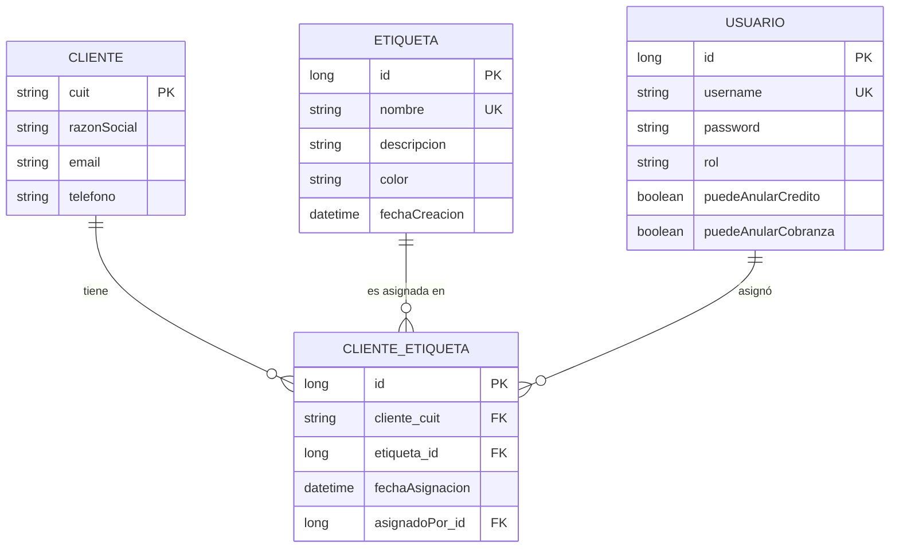

# Modelado — Sistema de Etiquetas para Clientes
**Materia:** Aplicaciones Interactivas · UADE 2026-1  
**Módulo elegido:** Sistema de etiquetas para clientes  
**Última actualización:** 07/04/2026

---

## Contexto del proyecto base

El proyecto base provee las siguientes entidades (las modificamos o extendemos según necesidad):

| Entidad base | Acción |
|---|---|
| `Cliente` | **MODIFICAR** — reemplazar `dni` por `cuit`, agregar `email`, `telefono`, `razonSocial` |
| `Credito` | Sin cambios (Entregas 1 y 2) |
| `Cuota` | Sin cambios |
| `Cobranza` | Sin cambios (Entrega 1 y 2) |
| `Usuario` | Sin cambios (Entrega 1 y 2) |

---

## Diagrama Entidad-Relación



---

## Entidades JPA — Detalle de campos

### `Cliente` *(modificada respecto al base)*

| Campo        | Tipo     | Restricciones            | Descripción                   |
|--------------|----------|--------------------------|-------------------------------|
| `cuit`       | `String` | PK, NOT NULL, max 13     | CUIT del cliente (ej: "20-12345678-9") |
| `nombre`     | `String` | NOT NULL, max 150        | Nombre de la persona/empresa  |
| `razonSocial`| `String` | NOT NULL, max 200        | Razón social del cliente      |
| `email`      | `String` | NOT NULL, UNIQUE, max 100| Email de contacto             |
| `telefono`   | `String` | NOT NULL, max 20         | Teléfono de contacto          |

> **Nota:** el proyecto base usa `dni` como PK String. Lo reemplazamos por `cuit` y agregamos `razonSocial`, `email` y `telefono` como campos **adicionales** (no reemplazamos `nombre`). Hay que actualizar `ClienteController`, `ClienteRequest`, `ClienteResponse` y la FK en `Credito` (`dni_cliente` → `cuit_cliente`).

### `Etiqueta` *(nueva)*

| Campo           | Tipo            | Restricciones            | Descripción                        |
|-----------------|-----------------|-------------------------|------------------------------------|
| `id`            | `Long`          | PK, auto-generado        | Identificador único                |
| `nombre`        | `String`        | NOT NULL, UNIQUE, max 50 | Ej: "Premium", "VIP", "Moroso"     |
| `descripcion`   | `String`        | max 255, nullable        | Descripción libre de la etiqueta   |
| `color`         | `String`        | NOT NULL, max 7          | Color hex **obligatorio** (ej: "#E63946") |
| `fechaCreacion` | `LocalDateTime` | NOT NULL, auto-asignado  | Se asigna automáticamente al persistir |

### `ClienteEtiqueta` *(nueva — tabla asociativa con atributos propios)*

> Se usa entidad intermedia explícita (y **no** `@ManyToMany` directo) porque la relación tiene datos propios: quién asignó y cuándo.

| Campo             | Tipo            | Restricciones                          | Descripción                         |
|-------------------|-----------------|----------------------------------------|-------------------------------------|
| `id`              | `Long`          | PK, auto-generado                      | Identificador único                 |
| `cliente`         | `Cliente`       | FK → `cliente.cuit`, NOT NULL          | Cliente al que se asignó            |
| `etiqueta`        | `Etiqueta`      | FK → `etiqueta.id`, NOT NULL           | Etiqueta asignada                   |
| `fechaAsignacion` | `LocalDateTime` | NOT NULL, auto-asignado                | Fecha en que se hizo la asignación  |
| `asignadoPor`     | `Usuario`       | FK → `usuario.id`, NOT NULL            | Usuario que realizó la asignación   |

> **Restricción de unicidad:** un cliente no puede tener la misma etiqueta dos veces:
> `@UniqueConstraint(columnNames = {"cliente_cuit", "etiqueta_id"})`

### Modificaciones a entidades existentes *(solo Entrega 3)*

**`Usuario`** — agregar:
```java
private boolean puedeAnularCredito = false;
private boolean puedeAnularCobranza = false;
```

**`Credito`** — agregar:
```java
private boolean anulado = false;
```

**`Cobranza`** — agregar:
```java
private LocalDate fechaCobranza = LocalDate.now();
private boolean anulada = false;
```

---

## Relaciones

```
Cliente (1) ────< ClienteEtiqueta >──── (N) Etiqueta
                       │
                       └──── (N) Usuario (asignadoPor)
```

- Un **Cliente** puede tener muchas **Etiquetas** (vía `ClienteEtiqueta`)
- Una **Etiqueta** puede estar asignada a muchos **Clientes** (vía `ClienteEtiqueta`)
- Cada asignación registra **quién la hizo** y **cuándo**

---

## Endpoints REST — Módulo de Etiquetas

### Clientes (CRUD extendido)

| Método   | Endpoint               | Descripción                                     | Auth |
|----------|------------------------|-------------------------------------------------|------|
| `POST`   | `/api/clientes`        | Crear cliente                                   | JWT  |
| `GET`    | `/api/clientes`        | Listar todos (con filtro por etiqueta opcional) | JWT  |
| `GET`    | `/api/clientes/{cuit}` | Obtener cliente por CUIT                        | JWT  |
| `PUT`    | `/api/clientes/{cuit}` | Modificar cliente                               | JWT  |
| `DELETE` | `/api/clientes/{cuit}` | Eliminar cliente (si no tiene etiquetas)        | JWT  |

> Filtro: `GET /api/clientes?etiqueta={nombre}` — filtra clientes que tengan esa etiqueta

### Gestión de etiquetas (CRUD) — accesible para cualquier usuario autenticado

| Método   | Endpoint              | Descripción                                        | Auth |
|----------|-----------------------|----------------------------------------------------|------|
| `GET`    | `/api/etiquetas`      | Listar todas las etiquetas                         | JWT  |
| `POST`   | `/api/etiquetas`      | Crear una nueva etiqueta                           | JWT  |
| `GET`    | `/api/etiquetas/{id}` | Obtener etiqueta por ID                            | JWT  |
| `PUT`    | `/api/etiquetas/{id}` | Modificar nombre/descripción/color                 | JWT  |
| `DELETE` | `/api/etiquetas/{id}` | Eliminar etiqueta (solo si no tiene clientes asignados) | JWT |

### Asignación de etiquetas a clientes

| Método   | Endpoint                                            | Descripción                              | Auth |
|----------|-----------------------------------------------------|------------------------------------------|------|
| `POST`   | `/api/clientes/{cuit}/etiquetas/{etiquetaId}`       | Asignar etiqueta a un cliente            | JWT  |
| `DELETE` | `/api/clientes/{cuit}/etiquetas/{etiquetaId}`       | Quitar etiqueta de un cliente            | JWT  |
| `GET`    | `/api/clientes/{cuit}/etiquetas`                    | Ver todas las etiquetas de un cliente    | JWT  |

### Consulta inversa

| Método | Endpoint                      | Descripción                             | Auth |
|--------|-------------------------------|-----------------------------------------|------|
| `GET`  | `/api/etiquetas/{id}/clientes`| Ver todos los clientes con esa etiqueta | JWT  |

### Gestor de permisos *(Entrega 3 — solo ADMIN)*

| Método | Endpoint                            | Descripción                            |
|--------|-------------------------------------|----------------------------------------|
| `GET`  | `/api/admin/usuarios`               | Listar usuarios con sus permisos       |
| `PUT`  | `/api/admin/usuarios/{id}/permisos` | Actualizar permisos de un usuario      |

### Anulaciones *(Entrega 3)*

| Método   | Endpoint              | Requiere permiso       |
|----------|-----------------------|------------------------|
| `DELETE` | `/api/creditos/{id}`  | `puedeAnularCredito`   |
| `DELETE` | `/api/cobranzas/{id}` | `puedeAnularCobranza`  |

---

## DTOs

### Request

| DTO                | Campos                                                                        | Uso                     |
|--------------------|-------------------------------------------------------------------------------|-------------------------|
| `ClienteRequest`   | `cuit` (req), `nombre` (req), `razonSocial` (req), `email` (req), `telefono` (req) | Crear/modificar cliente |
| `EtiquetaRequest`  | `nombre` (req), `color` (req), `descripcion`                                  | Crear o modificar etiqueta |
| `PermisosRequest`  | `puedeAnularCredito`, `puedeAnularCobranza`     | Actualizar permisos (Entrega 3)  |

### Response

| DTO                       | Campos                                                               | Uso                            |
|---------------------------|----------------------------------------------------------------------|--------------------------------|
| `ClienteResponse`         | `cuit`, `nombre`, `razonSocial`, `email`, `telefono`                | Retorno de cliente             |
| `EtiquetaResponse`        | `id`, `nombre`, `descripcion`, `color`, `fechaCreacion`             | Retorno de etiqueta            |
| `ClienteEtiquetaResponse` | `etiqueta` (EtiquetaResponse), `fechaAsignacion`, `asignadoPor`     | Retorno de asignación          |
| `UsuarioResponse`         | `id`, `username`, `rol`, `puedeAnularCredito`, `puedeAnularCobranza`| Gestor de permisos (Entrega 3) |
| `AuthResponse` *(mod. E3)*| agrega `puedeAnularCredito`, `puedeAnularCobranza`                  | Login/Register                 |

---

## Reglas de negocio

| Regla | Descripción |
|-------|-------------|
| **Nombre de etiqueta único** | Si el nombre ya existe, `BusinessException` (400) |
| **Asignación duplicada** | Un cliente no puede tener la misma etiqueta dos veces → `BusinessException` (400) |
| **Eliminar etiqueta** | No se puede eliminar si tiene clientes asignados → `BusinessException` (400) |
| **Color obligatorio** | El campo `color` es requerido en `EtiquetaRequest` → validado con `@NotBlank` |
| **CUIT único** | No puede haber dos clientes con el mismo CUIT |
| **Anular crédito** *(E3)* | No se puede anular si tiene cobranzas asociadas → `BusinessException` (400) |
| **Anular cobranza** *(E3)* | Solo si `fechaCobranza == LocalDate.now()` → `BusinessException` (400) |

---

## Estructura de archivos a crear/modificar

### Backend

```
backend/src/main/java/com/uade/tpejemplo/
├── model/
│   ├── Cliente.java                   ← MODIFICAR (dni→cuit, agregar campos)
│   ├── Etiqueta.java                  ← NUEVA
│   └── ClienteEtiqueta.java           ← NUEVA
├── repository/
│   ├── ClienteRepository.java         ← MODIFICAR (queries por cuit)
│   ├── EtiquetaRepository.java        ← NUEVA
│   └── ClienteEtiquetaRepository.java ← NUEVA
├── dto/
│   ├── request/
│   │   ├── ClienteRequest.java        ← MODIFICAR (cuit + nuevos campos)
│   │   └── EtiquetaRequest.java       ← NUEVA
│   └── response/
│       ├── ClienteResponse.java       ← MODIFICAR (cuit + nuevos campos)
│       ├── EtiquetaResponse.java      ← NUEVA
│       └── ClienteEtiquetaResponse.java ← NUEVA
├── service/
│   ├── ClienteService.java            ← MODIFICAR (agregar filtro por etiqueta)
│   ├── ClienteServiceImpl.java        ← MODIFICAR
│   ├── EtiquetaService.java           ← NUEVA (interfaz)
│   └── EtiquetaServiceImpl.java       ← NUEVA (implementación)
└── controller/
    ├── ClienteController.java         ← MODIFICAR (usar cuit, agregar filtro)
    └── EtiquetaController.java        ← NUEVA
```

### Frontend

```
frontend/src/
├── api/
│   ├── clientes.js                    ← MODIFICAR (usar cuit)
│   └── etiquetas.js                   ← NUEVA
├── store/slices/
│   ├── clientesSlice.js               ← MODIFICAR (usar cuit)
│   └── etiquetasSlice.js              ← NUEVA
└── pages/
    ├── Clientes.jsx                   ← MODIFICAR (mostrar nuevos campos)
    ├── Etiquetas.jsx                  ← NUEVA (gestión de etiquetas)
    └── ClienteEtiquetas.jsx           ← NUEVA (etiquetas de un cliente)
```

---

## Redux — Estado global del módulo (Entrega 2/3)

### `etiquetasSlice.js`

```
state.etiquetas = {
  lista: [],               // todas las etiquetas del sistema
  etiquetasCliente: [],    // etiquetas del cliente seleccionado
  clientesPorEtiqueta: [], // clientes con la etiqueta seleccionada
  loading: false,
  error: null
}

Thunks:
- fetchEtiquetas()
- addEtiqueta(etiquetaRequest)
- updateEtiqueta({ id, data })
- deleteEtiqueta(id)
- fetchEtiquetasPorCliente(cuit)
- asignarEtiqueta({ cuit, etiquetaId })
- quitarEtiqueta({ cuit, etiquetaId })
- fetchClientesPorEtiqueta(etiquetaId)
```
